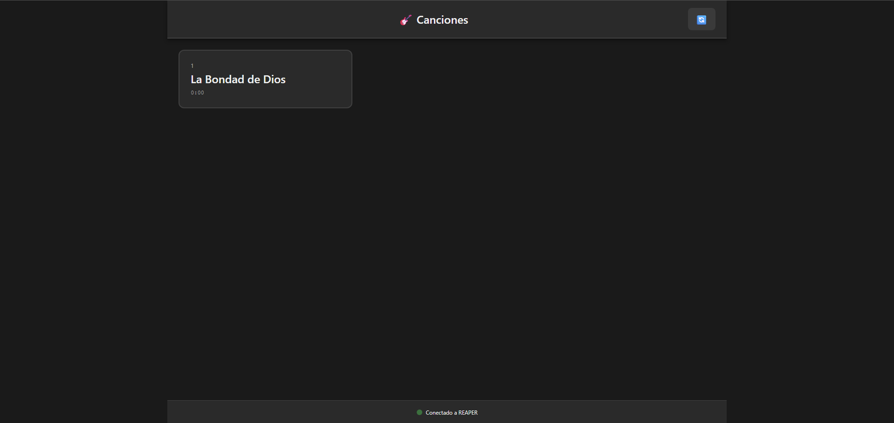
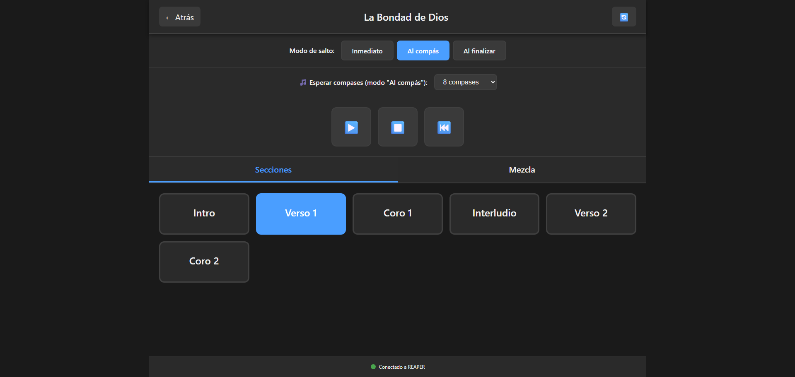
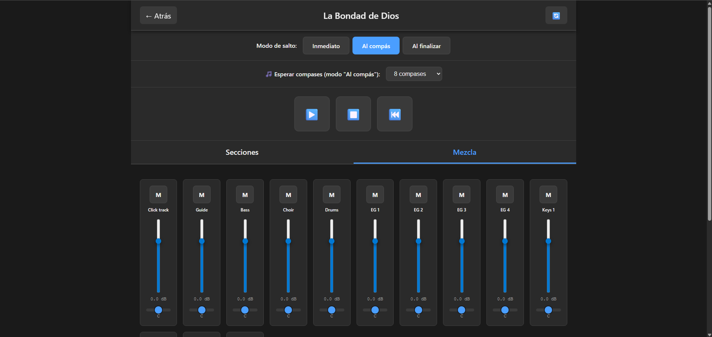

# 🎸 REAPER Live Remote

> 📖 Esta documentación también está disponible en [Español](README.md).

**Touch remote control for REAPER during live performances**

Designed for musicians playing with backing tracks, this web application allows you to control REAPER from a tablet without touching the laptop on stage.


---

## 🎯 Why use this?

If you play live with REAPER and need to:

- ✅ **Change songs** quickly between tracks
- ✅ **Jump between sections** (intro, verse, chorus, bridge) without touching the keyboard
- ✅ **Adjust mix** (click volume, guide, backing tracks)
- ✅ **Touch control** from a tablet on stage

**Then this application is for you.**

---

## ✨ Main Features

### 🎵 Song and Section Navigation
- Lists all songs in your REAPER project
- Large touch buttons for each section (intro, verse, chorus, etc.)
- Fast and intuitive navigation

### ⏱️ 3 Musical Jump Modes
1. **Immediate**: Instant jump (ideal for rehearsals)
2. **To the Bar**: Waits 1/2/4/8/16 bars before jumping (maintains timing live)
3. **On Finish**: Waits until the end of the current section before changing

### 🎛️ Real-time Mix Control
- Volume, pan, and mute faders per track
- **Automatic Sync**: changes in REAPER are reflected on the web in real-time
- Designed for tablets (large, easy to use on stage)
- Adjust click, guide, and backing tracks on the fly

### 🎮 Transport Controls
- Play/Stop
- Go to the start of the current song
- All accessible from the touch interface

### 🌐 Simple and Hassle-free
- HTTP only, no complex setup
- Works in any modern browser
- Tablet and PC on the same WiFi = ready to play

---

## 📸 Screenshots Gallery

### Song list view


### Song detail view - Sections (with jump modes)


### Song detail view - Mix (faders and controls)


---

## 🚀 Installation and Update

### 📥 Direct Download (No Git)
You don't need to know how to use Git or clone the repository.

1. Click the green **`<> Code`** button at the top right.
2. Select **`Download ZIP`**.
3. Extract the ZIP file content into a folder on your computer.

### ⚡ Automatic Installer (Recommended for Windows)
The installer sets up everything for you: web files, Lua scripts, SWS detection, and Command ID.

1. Open the folder where you extracted the ZIP.
2. Double-click **`install.bat`**.
3. Follow the on-screen instructions.

### 🔄 How to Update
If a new version is released:
1. Download the new ZIP and extract it.
2. Run **`install.bat`** again.
3. The script will detect your previous configuration and update the files while keeping your Command ID.

### 🍎 Mac / Linux
1. Open a terminal in the extracted folder.
2. Run:
   ```bash
   chmod +x install.sh
   ./install.sh
   ```

---

### 📋 Prerequisites

- **REAPER** v6.0 or higher.
- **SWS Extension** (optional but recommended for advanced jumps).
- Tablet and PC on the **same WiFi network**.

---

### 🔧 Final Configuration in REAPER

After installing, activate the interface in REAPER:

1. Go to **Preferences → Control/OSC/Web**.
2. Click **Add** and select **Web browser interface**.
3. Configure:
   - **Default interface**: `index.html` (or leave blank if using the default port).
   - **Port**: `8080` (or your preference).
4. Done! Access from your tablet using the IP shown by the installer.

---

## 🎼 How to prepare your REAPER project

The application requires you to organize your timeline like this:

### Structure: Regions = Songs, Markers = Sections

```
REAPER Timeline:

[Region: "Song 1"]  (0:00 - 3:00)
├─ 0:00  [Marker] Intro
├─ 0:30  [Marker] Verse
├─ 1:00  [Marker] Chorus
├─ 1:30  [Marker] Verse 2
├─ 2:00  [Marker] Chorus
└─ 2:30  [Marker] Outro

[Region: "Song 2"]  (3:00 - 6:00)
├─ 3:00  [Marker] Intro
├─ 3:30  [Marker] Verse
└─ 5:00  [Marker] Chorus
```

### Setup Steps:

1. **Create Regions for each full song**
   - Select the time range of the song
   - Right-click on timeline → "Insert region from time selection"
   - Name the region with the song name

2. **Create Markers for each section within the song**
   - Place the cursor at the start of each section
   - Press `Shift + M` (or right-click → "Insert marker")
   - Use descriptive names: "Intro", "Verse", "Chorus", "Bridge", "Solo", "Outro"

3. **Verify in Region/Marker Manager**
   - `View → Region/Marker Manager`
   - Ensure markers are **inside** the correct regions

---

## 🎮 How to use

### Main View: Song List

1. You will see all songs in your project (regions)
2. Tap a song to open its sections

### Song View

**"Sections" Tab:**
- Large buttons for each section of the song
- Tap a button to jump to that section
- **Jump Mode** selector at the top:
  - **Immediate**: Instant jump
  - **To the Bar**: Waits X bars (selector for 1/2/4/8/16)
  - **On Finish**: Waits until the end of the current section

**"Mix" Tab:**
- Vertical faders to adjust volume for each track
- **M** button for mute/unmute
- **Pan** control (L/R)

**Transport Controls:**
- ▶️ **Play**
- ⏹️ **Stop**
- ⏮️ **Go to start** of the song

---

## 📖 Jump Modes Explained

### 🏃 "Immediate" Mode
- **When to use**: Rehearsals, soundchecks
- **Behavior**: Instant jump, no waiting
- **Note**: May break the tempo if playing

### 🎵 "To the Bar" Mode
- **When to use**: Live performances, maintaining perfect timing
- **Behavior**: Plays X more bars, then jumps on the next beat
- **Configurable**: 1, 2, 4, 8, or 16 bars
- **Ideal for**: Keeping the groove during the show

**Example** (with 1 bar):
```
You are in "Verse" - Bar 10, beat 3
→ You tap "Chorus"
→ Finishes playing bar 10 (beat 4)
→ Upon reaching bar 11 → jumps to "Chorus"
```

### 🎭 "On Finish" Mode
- **When to use**: Long transitions, intros, elaborate endings
- **Behavior**: Plays until the end of the current section/region, then jumps
- **Ideal for**: Natural transitions without abrupt cuts

---

## 🛠️ Project Structure

```
reaper-live-remote/
├── 📄 README.md              # This file - Main Guide (Spanish)
├── 📄 README.en.md           # English version
├── 📄 INSTALL.md             # Detailed installation guide
├── 📄 LICENSE                # MIT License
├── 📦 package.json           # Project configuration
│
├── 🚀 Installers (USE THESE!)
│   ├── install.bat           # Automatic installer (double-click)
│   ├── install.ps1           # PowerShell installer (complete)
│   ├── verify-install.ps1    # Verify everything is correct
│   ├── deploy.bat            # Just copy files (simple)
│   └── deploy.ps1            # Just copy files (PowerShell)
│
├── 🌐 webroot/               # Frontend (copied to reaper_www_root)
│   ├── index.html            # Main view (song list)
│   ├── song.html             # Detail view (sections/mix)
│   ├── demo.html             # Demo without REAPER
│   ├── css/app.css           # Styles
│   └── js/
│       ├── api.js            # REAPER communication
│       ├── state.js          # Global state
│       ├── ui.js             # UI rendering
│       └── utils.js          # Utilities
│
├── 🎼 reaper-scripts/        # Lua scripts for REAPER
│   ├── smooth_seeking_control_v3.lua  # Advanced jump control
│   ├── README.md             # Scripts documentation
│   └── SCRIPTS-GUIDE.md      # Detailed guide
│
├── 📚 docs/ Technical documentation
│   ├── mapping.md            # REAPER API mapping
│   ├── deploy.md             # Full deployment guide
│   └── server-setup.md       # 🆕 Web server configuration
│
└── 🧪 tests/
    └── mock-api.json         # Test data
```

---

## 🐛 Troubleshooting

### ❓ Something not working?

**Run the verifier:**
```powershell
.\verify-install.ps1
```

This script automatically checks:
- ✅ Web files installed correctly
- ✅ Lua script registered
- ✅ SWS Extension installed
- ✅ Command ID configured
- ✅ Web server active
- ✅ Local IP to connect

---

### ❌ Cannot connect to REAPER

**Check:**
- ✅ Web server is enabled in Preferences
- ✅ Tablet and PC are on the same WiFi network
- ✅ Try opening `http://localhost:8080` on the PC first
- ✅ Windows Firewall allows REAPER on private network

### ❌ No songs appearing

**Check:**
- ✅ Project has **regions** (not just markers)
- ✅ Save the project: `Ctrl + S`
- ✅ Reload the web page

### ❌ No sections appearing

**Check:**
- ✅ There are **markers inside each region**
- ✅ Open `View → Region/Marker Manager` to verify
- ✅ Markers are in the correct time range

### ❌ "To the Bar" mode not working

**Check:**
- ✅ You registered `smooth_seeking_control_v3.lua`
- ✅ You copied the correct Command ID to `state.js`
- ✅ You have SWS Extension installed

### ❌ Faders not responding

**Check:**
- ✅ Correct username/password (if configured)
- ✅ Tracks are visible in REAPER
- ✅ Check browser console (F12) for errors

---

## 🧪 Demo Mode (without REAPER)

To test the application without having REAPER installed:

1. Open `webroot/demo.html` in your browser
2. Or serve with a local server:
   ```bash
   cd webroot
   python -m http.server 8000
   # Then open: http://localhost:8000/demo.html
   ```

The application will use simulated data from `tests/mock-api.json`.

---

## 📚 Additional Documentation

### 🚀 Installation and Setup
- **[INSTALL.md](INSTALL.md)** - Step-by-step installation guide with screenshots
- **[WELCOME.md](WELCOME.md)** - Quick introduction to the project
- **[SCRIPTS-INFO.md](SCRIPTS-INFO.md)** - Explanation of each installation script
- **[docs/server-setup.md](docs/server-setup.md)** - Configure web server in REAPER (with troubleshooting)

### 📖 Usage and Development
- **[docs/mapping.md](docs/mapping.md)** - REAPER HTTP endpoints and API functions
- **[docs/deploy.md](docs/deploy.md)** - Full deployment guide
- **[reaper-scripts/README.md](reaper-scripts/README.md)** - Lua scripts documentation
- **[reaper-scripts/SCRIPTS-GUIDE.md](reaper-scripts/SCRIPTS-GUIDE.md)** - Detailed scripts guide

---

## 🚧 Known Limitations

- Requires active connection to REAPER (does not work offline)
- HTTP latency of ~50-200ms (acceptable for most cases)
- Maximum ~20 tracks visible without scroll
- Mixer polling every 500ms (sufficient for live use)
- No real-time VU meters (future)

---

## 🎯 Roadmap

- [x] ~~Automatic mixer synchronization with REAPER~~
- [ ] Customizable colors by section type
- [ ] Save/recall mix snapshots
- [ ] Automatic reconnection after WiFi loss

---

## 🤝 Contributing

Contributions are welcome! If you find a bug or have an idea:

1. Open an **Issue** describing the problem/improvement
2. **Fork** the repository
3. Create a **branch** for your feature: `git checkout -b feature/new-functionality`
4. **Commit** your changes: `git commit -m 'Add new functionality'`
5. **Push**: `git push origin feature/new-functionality`
6. Open a **Pull Request**

---

## 📜 License

This project is under the **MIT** license. See the [LICENSE](LICENSE) file for more details.

---

## 🙏 Acknowledgments

- Inspired by the real needs of live musicians
- Built with standard REAPER tools
- Thanks to the REAPER community for documentation and support

---

## 📞 Contact

If you have questions or suggestions, open an Issue on GitHub.

---
